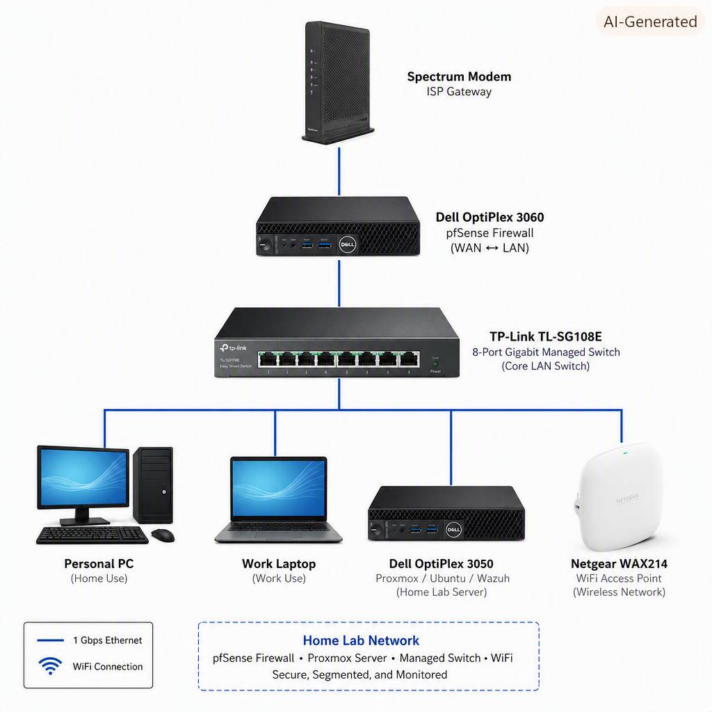

# 🔐 Security Write-ups

This repository contains documented security investigations performed in my home SOC lab — a self-hosted environment running Proxmox, Ubuntu Server, Windows 11, pfSense, and Wazuh SIEM.  
Each investigation follows a consistent SOC-style workflow:

**Detection → Research → Investigation → Remediation → Verification → Lessons Learned**

These write-ups demonstrate real-world skills in threat detection, vulnerability analysis, log triage, and incident documentation.

---
# 🔒 Security Write-ups

This repository contains documented security investigations performed in my home SOC lab...

## 🗺️ Network Architecture Diagram

## 📌 Featured Investigations

These are my most detailed and representative investigations. Each includes full documentation inside its folder.

### **Windows Logon Success Alert Triage**  
**Skills:** Log analysis, authentication triage, MITRE ATT&CK mapping  
**Tools:** Wazuh SIEM, Windows Event Logs  
**Summary:** Investigated repeated successful logon events to determine whether they indicated normal user behavior, credential misuse, or lateral movement.

### **Git Credential Helper Carriage Return Confusion (CVE-2024-52006)**  
**Skills:** Vulnerability analysis, exploit reproduction, secure configuration  
**Tools:** Git, Linux, Wazuh  
**Summary:** Analyzed a Git credential parsing flaw that could lead to misinterpreted authentication data and insecure credential handling.

### **Vite Arbitrary File Read via WebSocket fetchModule Bypass (CVE-2026-39363)**  
**Skills:** Web security, file read exploitation, threat modeling  
**Tools:** Linux, Vite dev server, Wazuh  
**Summary:** Demonstrated how malformed WebSocket requests could bypass file access restrictions and expose sensitive files.

### **node-tar Path Traversal Cluster**  
**Skills:** Path traversal exploitation, filesystem security, remediation planning  
**Tools:** Linux, node-tar, Wazuh  
**Summary:** Investigated multiple related CVEs involving symlink/hardlink traversal that could lead to arbitrary file write or overwrite.

### **Steam Client Registry Permission Weakness (CVE-2019-14743)**  
**Skills:** Windows registry analysis, privilege escalation research  
**Tools:** Windows 11, Wazuh, MITRE ATT&CK  
**Summary:** Explored how weak registry permissions could allow unauthorized modification of Steam client settings.

---

## 📂 Full Write-up Index

- [CVE-2026-27606 — Rollup Path Traversal RCE](https://github.com/Rgraf228/Security-writeups/tree/main/CVE-2026-27606)
- [CVE-2015-7985 — Valve Steam Weak Install Folder Permissions](https://github.com/Rgraf228/Security-writeups/tree/main/CVE-2015-7985)
- [CVE-2019-14743 — Valve Steam Client Registry Permission (Disputed)](https://github.com/Rgraf228/Security-writeups/tree/main/CVE-2019-14743)
- [MITRE ATT&CK T1078 — Windows Logon Success Alert Triage](https://github.com/Rgraf228/Security-writeups/tree/main/T1078-Windows-Logon-Success)
- [CVE-2024-52006 — Git Credential Helper Carriage Return Confusion](https://github.com/Rgraf228/Security-writeups/tree/main/CVE-2024-52006)
- [CVE-2024-52005 — Git Sideband Channel ANSI Escape Sequence Injection](https://github.com/Rgraf228/Security-writeups/tree/main/CVE-2024-52005)
- [CVE-2015-4016 — Valve Steam Remote Denial of Service](https://github.com/Rgraf228/Security-writeups/tree/main/CVE-2015-4016)
- [CVE-2026-53571 — Vite server.fs.deny Bypass via Windows Alternate Paths](https://github.com/Rgraf228/Security-writeups/tree/main/CVE-2026-53571)
- [CVE-2026-39364 — Vite server.fs.deny Bypass via Query Parameters](https://github.com/Rgraf228/Security-writeups/tree/main/CVE-2026-39364)
- [CVE-2026-39363 — Vite Arbitrary File Read via WebSocket fetchModule Bypass](https://github.com/Rgraf228/Security-writeups/tree/main/CVE-2026-39363)
- [CVE-2026-33671 — Picomatch ReDoS via Extglob Quantifiers](https://github.com/Rgraf228/Security-writeups/tree/main/CVE-2026-33671)
- [node-tar CVE Cluster — Hardlink/Symlink Path Traversal & Arbitrary File Write](https://github.com/Rgraf228/Security-writeups/tree/main/node-tar-CVE-cluster)
- [npm Audit Batch Remediation — brace-expansion, glob, minimatch, yaml](https://github.com/Rgraf228/Security-writeups/tree/main/npm-audit-batch-remediation)
- [CVE-2026-15168 — Wireshark BLF File Parser Information Disclosure](https://github.com/Rgraf228/Security-writeups/tree/main/CVE-2026-15168)
- [CVE-2026-50520 — Visual Studio Code Remote Code Execution via Command Injection](https://github.com/Rgraf228/Security-writeups/tree/main/CVE-2026-50520)
 

---

## 🛠 Tools Used

- Wazuh SIEM (manager, indexer, dashboard)  
- pfSense firewall (VLANs, segmentation, rules)  
- Proxmox virtualization  
- Windows 11 endpoint  
- Ubuntu Server  
- Git, node-tar, Vite  
- MITRE ATT&CK  
- CIS Benchmarks  

---

## 🧠 Skills Demonstrated

- Log analysis & alert triage  
- Threat detection & investigation  
- Vulnerability reproduction & testing  
- Endpoint hardening  
- Network segmentation  
- Documentation & reporting  
- MITRE ATT&CK technique mapping  

---

## 📁 Related Portfolio

For my full SOC/NOC portfolio and home lab documentation, visit my GitHub profile:  
**https://github.com/Rgraf228**
